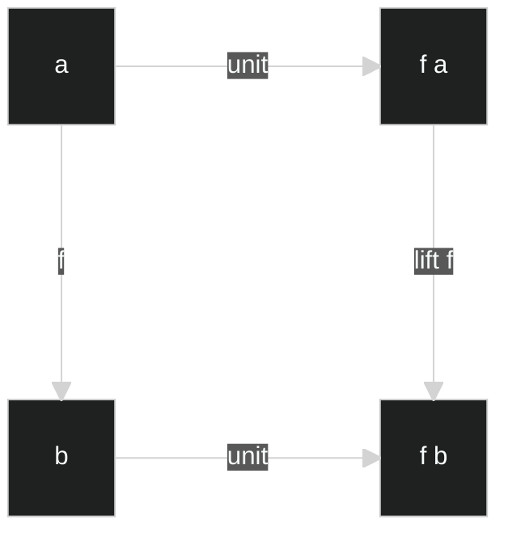
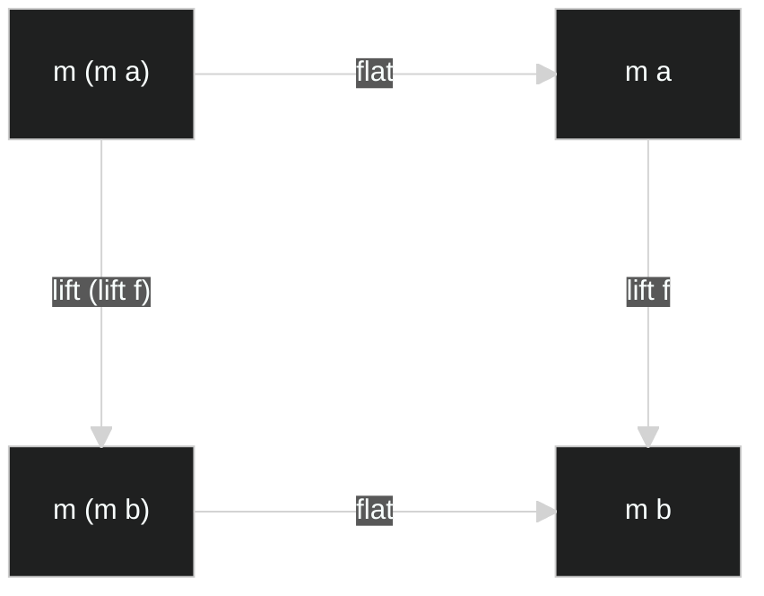
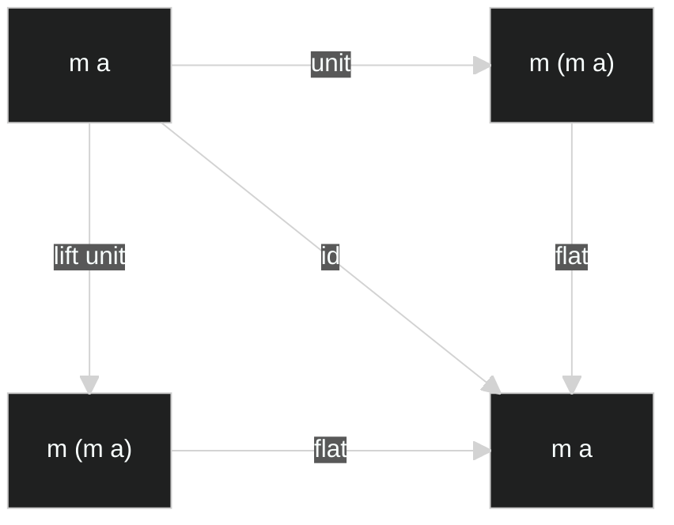
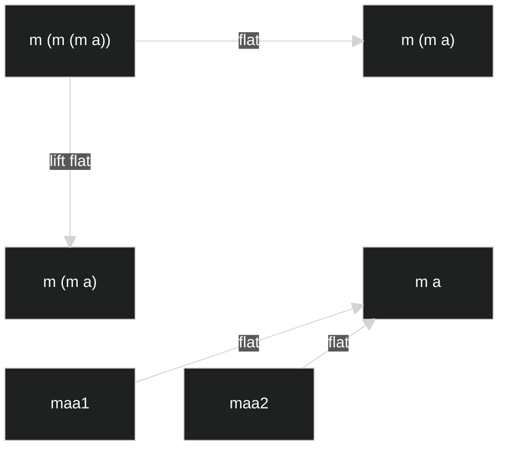

# 1. The “ideal” Monad

## 1.1. Functor

```haskell
class Functor f where
  lift :: (t -> u) -> f t -> f u
  -- [identity conservation]    lift id = id
  -- [composition conservation] lift (f . g) = lift f . lift g
```

## 1.2. High-dimensional lift

```haskell
lift_e1 :: Functor f => (a -> b -> c) -> f a -> b -> f c
lift_e1 t fa b = lift (\a -> t a b) fa

lift_e2 :: Functor f => (a -> b -> c) -> a -> f b -> f c
lift_e2 t a fb = lift (\b -> t a b) fb
```

```haskell
lift_2d :: Functor f => (a -> b -> c) -> f a -> f b -> f (f c)
lift_2d = lift_e1 . lift_e2
lift_2d = lift_e2 . lift_e1

lift_2d t fa fb =
  lift (\a ->
    lift (\b ->
      t a b
    ) fb
  ) fa
```

```
lift_3d :: Functor f => (a -> b -> c -> d) -> f a -> f b -> f c -> f (f (f d))
lift_3d t fa fb fc =
  lift (\a ->
    lift (\b ->
      lift (\c ->
        t a b c
      ) fc
    ) fb
  ) fa
```

## 1.3. Monad

```haskell
class Functor m => Monad m where
  unit, return :: a -> m a
  flat, join :: m (m a) -> m a

  -- bind :: m a -> (a -> m b) -> m b
  -- flatmap :: (m a -> a -> m b) -> m b
  -- 특정 언어들의 사정에 맞게 변경된 버전.

  -- [naturality for unit] for given f :: a -> b,
  --                       unit . f  = (lift f) . unit
  -- [naturality for flat] for given f :: a -> b,
  --                       flat . lift (lift f) = (lift f) . flat
  -- [identity] id = flat . unit = flat . (lift unit)
  -- [associativity] flat . flat = flat . (lift flat)
```

### <p align="center">[naturality for unit]</p>



### <p align="center">[naturality for flat]</p>



### <p align="center">[identity]</p>



### <p align="center">[associativity]</p>



# 2. Monad in Mathematics

# 3. Monad in practice
