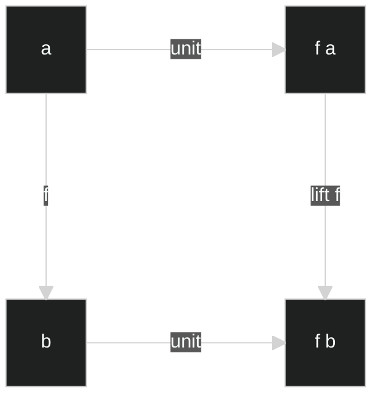
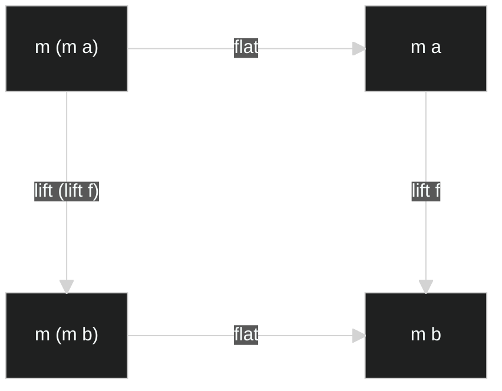
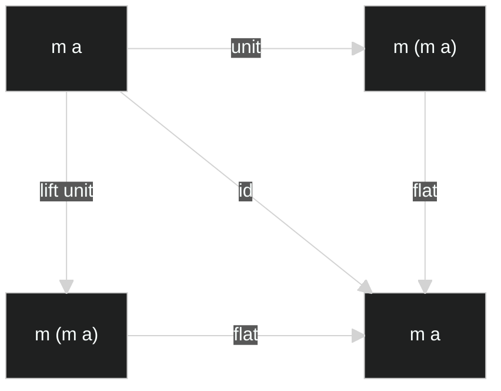
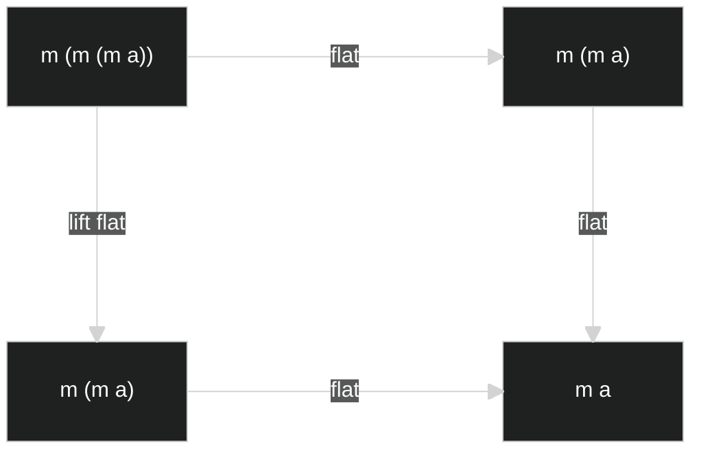
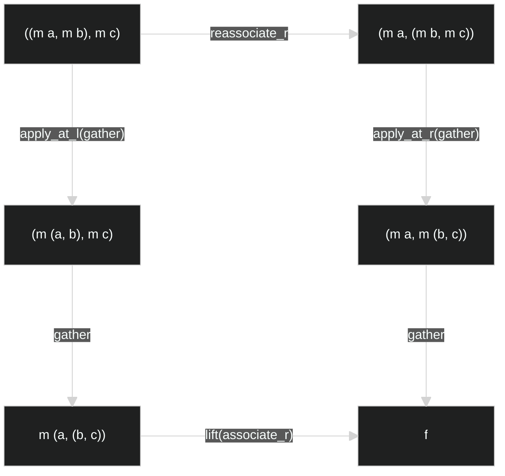
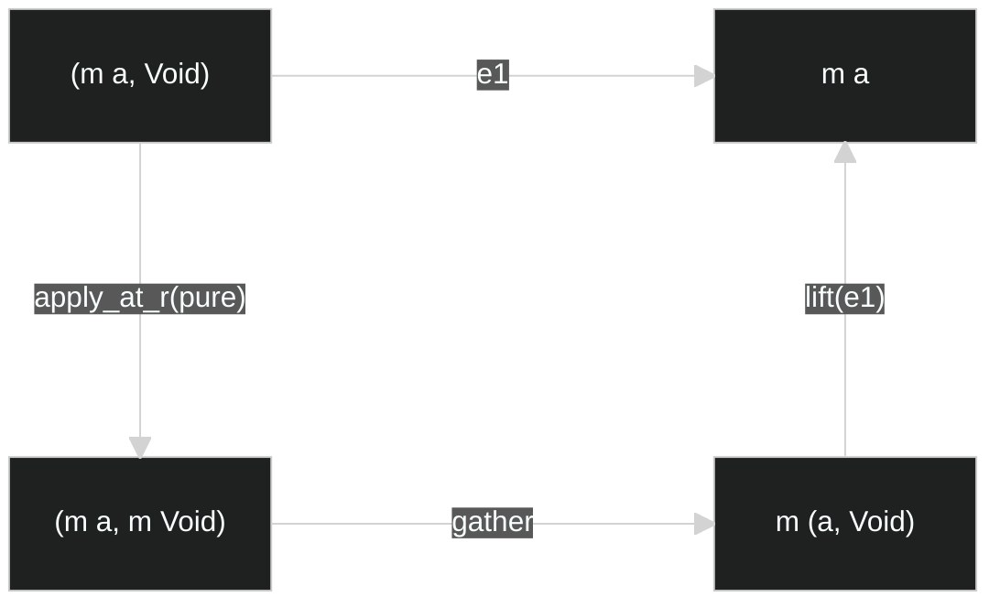

# 1. The “ideal” Monad

## 1.1. Functor

```haskell
class Functor' f where
  lift :: (t -> u) -> f t -> f u
  -- [identity conservation]    lift id = id
  -- f1 :: Functor' f => f a -> f a
  -- f1 = lift id
  -- f1 = id

  -- [composition conservation] lift (f . g) = lift f . lift g
  -- f2 :: Functor' t => (b -> c) -> (a -> b) -> t a -> t c
  -- f2 f g = lift (f . g)
  -- f2 f g = lift f . lift g
```

## 1.2. High-dimensional lift

```haskell
lift_e1 :: Functor' f => (a -> b -> c) -> f a -> b -> f c
lift_e1 t fa b = lift (\a -> t a b) fa

lift_e2 :: Functor' f => (a -> b -> c) -> a -> f b -> f c
lift_e2 t a fb = lift (\b -> t a b) fb
```

```haskell
lift_2d :: Functor' f => (a -> b -> c) -> f a -> f b -> f (f c)
lift_2d = lift_e1 . lift_e2
lift_2d = lift_e2 . lift_e1

lift_2d t fa fb =
  lift (\a ->
    lift (\b ->
      t a b
    ) fb
  ) fa
```

```
lift_3d :: Functor' f => (a -> b -> c -> d) -> f a -> f b -> f c -> f (f (f d))
lift_3d t fa fb fc =
  lift (\a ->
    lift (\b ->
      lift (\c ->
        t a b c
      ) fc
    ) fb
  ) fa
```

## 1.3. Monad

```haskell
class Functor' m => Monad' m where
  unit, return :: a -> m a
  flat, join :: m (m a) -> m a

  -- bind :: m a -> (a -> m b) -> m b
  -- flatmap :: (m a -> a -> m b) -> m b
  -- 특정 언어들의 사정에 맞게 변경된 버전.

  -- [naturality for unit] for given f :: a -> b,
  --                       unit . f  = (lift f) . unit
  -- f3 :: Monod' m => (a -> b) -> a -> fb
  -- f3 f = unit . f
  -- f3 f = (lift f) . unit

  -- [naturality for flat] for given f :: a -> b,
  --                       flat . lift (lift f) = (lift f) . flat
  -- f4 :: Monad' m => (a -> b) -> m (m a) -> m b
  -- f4 f = flat . lift (lift f)
  -- f4 f = (lift f) . flat

  -- [identity] id = flat . unit = flat . (lift unit)
  -- f5 :: Monad' m => m a -> m a
  -- f5 = id
  -- f5 = flat . unit
  -- f5 = flat . (lift unit)

  -- [associativity] flat . flat = flat . (lift flat)
  -- f6 :: Monad' m => m (m (m a)) -> m a
  -- f6 = flat . flat
  -- f6 = flat . (lift flat)
```

### <p align="center">[naturality for unit]</p>



### <p align="center">[naturality for flat]</p>



### <p align="center">[identity]</p>



### <p align="center">[associativity]</p>



## 1.4. flatlift

모나드의 유용성을 알아보자.

```haskell
lift :: Functor' f => (a -> b) -> f a -> f b
unit :: Monad' m => a -> m a
flat :: Monad' m => m (m a) -> m a

f :: Monad' m => a -> m b
g :: Monad' m => b -> m c
```

이러한 `f`와 `g`가 있을 때, 이들을 자연스럽게 합성하려면 어떻게 해야할까?

우선 lift g에 대해 작성해보자.

```haskell
lift_g :: Monad' m => m b -> m (m c)
lift_g = lift g
```

우리는 자연스러운 합성을 위해 `m b -> m c`를 원한다.

이는 `lift_g :: m b -> m (m c)`와 `flat :: m (m c) -> m c`의 합성으로 얻어낼 수 있다.

```haskell
flatlift_g :: Monad' m => m b -> m c
flatlift_g = flat . lift_g
```

이제 일반화된 `flatlift`를 정의해보자. `flatlift`는 인자로 `g :: b -> m c`와 같은 형태를 받을 것이다.

```haskell
flatlift :: Monad' m => (b -> m c) -> m b -> m c
flatlift g = flat . (lift g)
```

이제 우리는 `f`와 `g`의 자연스러운 합성을 정의할 있다.

```haskell
compose_ex :: Monad' m => (b -> m c) -> (a -> m b) -> a -> m c
compose_ex g f = (flatlift g) . f
```

우리가 사용하던 `Functor`의 `lift`의 차원 확장에는 불편함이 있었으니,

```haskell
lift_2d :: Functor' f => (a -> b -> c) -> f a -> f b -> f (f c)
lift_2d t fa fb =
  lift (\a ->
    lift (\b -> t a b) fb
  ) fa
```

바로 마지막 반환값에 제너릭이 중첩된다는 불편함이었다.

이제 우리는 `flatlift`의 차원 확장을 통해 중첩되지 않는 제너릭을 반환하는 함수를 정의할 수 있게 되었다.

```haskell
flatlift_2 :: Monad' m => (a -> b -> m c) -> m a -> m b -> m c
flatlift_2 t ma mb =
  flatlift (\a ->
    flatlift (\b -> t a b) mb
  ) ma

flatlift_3 :: Monad' m => (a -> b -> c -> m d) -> m a -> m b -> m c -> m d
flatlift_3 t ma mb mc =
  flatlift (\a ->
    flatlift (\b ->
      flatlift (\c -> t a b c) mc
    ) mb
  ) ma
```

고로 `flatlift_{n}`는 제너릭을 반환하는 함수를 자연스럽게 확장시킬 수 있게 도와주는 고마운 도구이다.

만약 제너릭을 반환하지 않는 `(a -> b -> c)`의 형태더라도 `c`에 `unit`을 씌워 `m c`로 만들 수 있다.

## 1.A.1. 부록 - Monoidal Functor

`Functor`와 `Monad` 사이에는 `Applicative Functor`라는 중간 단계가 있다.

`Applicative Functor`는 원래 `Monoidal Functor`라고 하는 것의 다른 이름이다.

우선 `Monoidal Functor`가 있기 위해서는 다음과 같은 타입들을 지원해야 한다:

```haskell
-- empty type의 존재
data Void

-- 2-tuple type의 존재
data two_tuple a b = (a, b)
```

그리고 다음과 같은 기본 함수들을 제공해야 한다:

```haskell
empty :: () -> Void
empty a = case a of {}

unite :: (a, b) -> (a, b)
unite (a, b) = (a, b)

e1 :: (a, b) -> a
e1 (a, _) = a

e2 :: (a, b) -> b
e2 (_, b) = b
```

사실 `Monoidal Functor`는 다음 부록에서 소개할 `Applicative Functor`를 먼저 보고 오는 게 편할 수 있는데,

`Applicative Functor`에서 `currying`이라는 개념이 나오기 때문이다.

`Monoidal Functor`에서는 n-tuple의 존재와, curying의 개념을 사용하지 않아서

n개의 인자를 받아 중첩된 2-tuple을 반환하는 `unite_{n}` 함수와

(n-다인수 함수를 입력으로 받는 함수)를 입력으로 받아, (중첩된 2-tuple을 입력으로 받는 함수)를 반환하는 `unite_arg_{n}` 함수가 필요하다.

여기서 중첩된 2-tuple이란,

```haskell
-- (a, b, c, d)
-- 를, 다음과 같이 표현하는 것.
-- (((a, b), c), d))
```

또한, 서로 다른 구조를 가진 두 중첩된 2-tuple 타입 사이의 변환 함수 `reassociate_r`과 `reassociate_l` 함수까지 정의가 필요하다.

앞서 말한 함수들을 모두 작성해보자:

```haskell
unite_0 = empty
unite_1 = id
unite_{n} :: (t1, t2, ..., t{n}) -> ((... ((t1, t2), t3), ...), t{n})
unite_{n} (t1, t2, ..., t{n}) = unite(unite_{n-1}(t1, t2, ..., t{n-1}), t{n})
-- 여기서 (t1, t2, ..., t{n})은 n-tuple이 아니라, n개의 입력을 받는 다인수 함수의 입력 부분인 것이다.
```

```haskell
unite_arg_2 f p = f( e1(p) , e2(p) )
unite_arg_3 f p = f( e1(e1(p)) , e2(e1(p)) , e2(p) )
unite_arg_4 f p = f( e1(e1(e1(p))) , e2(e1(e1(p))) , e2(e1(p)) , e2(p) )
unite_arg_{n} :: ((t1, t2, ..., t{n}) -> u) -> (((... (t1, t2), t3), ...), t{n} -> u)
```

```haskell
reassociate_r :: ((a, b), c) -> (a, (b, c))
reassociate_r p = unite( e1(e1(p)) , unite( e2(e1(p)) , e2(p) ) )
reassociate_l :: (a, (b, c)) -> ((a, b), c)
reassociate_l p = unite( unite( e1(p) , e1(e2(p)) ) , e2(e2(p)) )
```

그리고 2-tuple의 왼쪽에만 함수를 적용해주는 `apply_at_l`과 오른쪽에만 적용해주는 `apply_at_r`도 추가적으로 정의하자.

이 함수는 변환함수 `(a -> c)` 또는 `(b -> c)`를 입력으로 받아서 (2-tuple을 변환해주는 함수)를 반환하는 함수이다.

```haskell
apply_at_l :: (a -> c) -> ((a, b) -> (c, b))
apply_at_l t (a, b) = (t(a), b)
apply_at_r :: (b -> c) -> ((a, b) -> (a, c))
apply_at_r t (a, b) = (a, t(b))
```

그렇다면 이제 `Monoidal Functor`에 대해 작성해보자:

```haskell
class Functor' m => MonoidalFunctor m where
  pure' :: a -> m a
  gather :: (m a, m b) -> m (a, b)

  -- [conservation of associativity]    lift(reassociate_r) . gather . apply_at_l(gather) = gather . apply_at_r(gather) . reassociate_r
  -- f7 :: MonoidalFunctor m => ((m a, m b), m c) -> m (a, (b, c))
  -- f7 = lift(reassociate_r) . gather . apply_at_l(gather)
  -- f7 = gather . apply_at_r(gather) . reassociate_r

  -- [conservation of identity element] e1 = lift(e1) . gather . apply_at_l(pure)
  -- f8 :: MonoidalFunctor m => (m a, Void) -> m a
  -- f8 = e1
  -- f8 = lift(e1) . gather . apply_at_r(pure')
```

그렇다면 `Monoidal Functor`는 왜 있는 것일까?

바로, 다인수 함수의 자연스러운 `lift`를 위해서이다.

```haskell
lift_2d :: Functor' f => ((a, b) -> c) -> ((f a, f b) -> f (f c))
```

`Functor`에서 정의한 다인수 함수에서 반환값은 차원만큼이나 제너릭이 중첩되어 있다.

우리는 중첩되지 않은 제너릭을 반환하는 `lift_{n}`을 정의하고 싶은 것이다.

```haskell
lift_0 :: Functor' f => (Void -> a) -> (Void -> f a)
```

그리고 아무 인수를 요구하지 않는 함수도 `lift_0

### <p align="center">[conservation of associativity]</p>



### <p align="center">[conservation of identity]</p>



## 1.A.2. 부록 - Applicative Functor

함수형 프로그래밍 언어들에서는 다인수 함수를 어떻게 다룰까?

우리가 `Functor`와 `Monad`에 대해 알아보며 `lift`와 `flatlift`의 차원 확장을 해보았었다.

```haskell
lift_3d :: Functor' f => (a -> b -> c -> d) -> f a -> f b -> f c -> f (f (f d)))
```

함수라고 생각하면 `입력값 -> 출력값`의 형태로만 생겨야될 것 같지만, 이 곳에서는 화살표가 너무 많다.

이 것을 우리가 쉽게 생각할 수 있는 다인수 함수 버전으로 바꾸면 다음과 같다:

```haskell
lift_3d :: Functor' f => ((a, b, c) -> d) -> (f a -> (f b -> (f c -> f (f (f d)))))
lift_3d :: Functor' f => (((a, b, c) -> d), f a, f b, f c) -> f (f (f d))
```

사실 이래도 화살표를 1개로 만들 수는 없다.

왜냐면 입력값에 함수가 들어가기 때문이다.

우리가 보통 다인수 함수를 생각해보면 `f(t, u, v) -> w` 이런식이다.

입력값 t, u, v를 받아서 w를 반환하겠다는 것인데,

f가 입력값 t 한 개만 받고, u와 v는 f가 반환하는 함수에 넣어 w를 반환시키게 만들면 어떨까?

더 나아가, f가 반환하는 함수가 u, v 두 개를 받는 게 아니라 u 한 개만 받고, v를 받아 w를 반환하는 함수를 반환하게 만들면 어떨까?

말로는 복잡하지만, 수식으로 보면 이렇다.

```haskell
f0 :: (t, u, v) -> w
f1 :: t -> ((u, v) -> w)
f2 :: t -> (u -> (v -> w))
```

그 결과, 값 w를 얻기 위해서 f0(t, u, v)를 쓰거나 f2(t)(u)(v)를 쓰는 것은 똑같다.

그렇다면 왜 이런식으로 함수를 반환하는 함수 같은 것을 쓰는 걸까?

다인수 함수의 경우, 인자가 한 개라도 없으면 호출할 수 없지만,

이러한 형태의 함수는 앞에서부터 주어지는 인자부터 넣으며 함수를 반환하는 함수를 반환하기 떄문에, 유연하다.

사실 Haskell에서,

```haskell
f2 :: t -> (u -> (v -> w))
f3 :: t -> u -> v -> w
```

다음 두 함수는 완전히 똑같다. 즉 화살표 연산자는 괄호를 붙일 때, 오른쪽 얘들부터 결합시킨다는 것이다.

이러한 방식의 연산자를 right-to-left associativity를 가졌다고 말한다.

그렇다고,

```haskell
f0 :: (t, u, v) -> w
f3 :: t -> u -> v -> w
```

다음 두 함수가 인자들에 따라 하는 방식이 똑같다고 해도, 호출 방식은 다른데,

```haskell
f0 (t, u, v)

f3(t)(u)(v)
-- 또는
(((f3 t) u) v)
-- 또는
f3 t u v
```

`f0`의 경우 호출방식은 1개이다.

반면에 `f3`의 경우 우리가 흔히 아는 것처럼 `f3(t)(u)(v)`로 호출할 수도 있지만 괄호가 많아 번거롭다.

그래서 하스켈에서는 이런 함수를 괄호 없이 호출하는 방법이 있는데 `(((f3 t) u) v)` 이런식으로 함수 다음에 인자를 공백으로만 구분해 써주면

이게 `f3(t)`처럼 호출하는 게 된다는 것이다.

더군다나 `f3 t`가 반환하는 것도 함수이기에, 바로 뒤에 `u`를 붙이고, `f3 t u`가 반환하는 것도 함수이기에,

바로 뒤에 `v`를 붙여도 되는 것이다. 형태는 `f3 t u v` 이런식이다.

이걸 보면 이러한 형태의 함수를 사용하는 것의 이점이 바로 보인다.

`v`를 사용하지 않고 `f3 t u`까지만 진행하여 `v -> w`인 함수를 얻을 수 있는 것이다.

이러한 형태의 함수를 currying된 함수라고 부른다.

일반 다인수 함수를 currying된 함수로 curry해주는 함수가 있다.

```haskell
currying_3 :: ((a, b, c) -> d) -> a -> b -> c -> d
currying_3 t =
  (\a ->
    (\b ->
      (\c -> t (a, b, c))
    )
  )

currying_{n} :: ((t1, t2, ..., t{n}) -> u) -> t1 -> t2 -> ... -> t{n} -> u
currying_{n} t =
  (\t1 ->
    (\t2 ->
      ...
        (\t{n} -> t (t1, t2, ..., t{n})
      ...
    )
  )
```

물론 currying된 함수를 원래 다인수 함수로 되돌리는 함수도 있다.

```haskell
uncurrying_3 :: (a -> b -> c -> d) -> ((a, b, c) -> d)
uncurrying_3 t = (\(a, b, c) -> t a b c)

uncurrying_{n} :: (t1 -> t2 -> ... -> t{n} -> u) -> ((t1, t2, ..., {tn}) -> u)
uncurrying_{n} t = (\(t1, t2, ..., t{n}) -> t t1 t2 ... t{n})
```


# 2. Monad in Mathematics

# 3. Monad in practice
