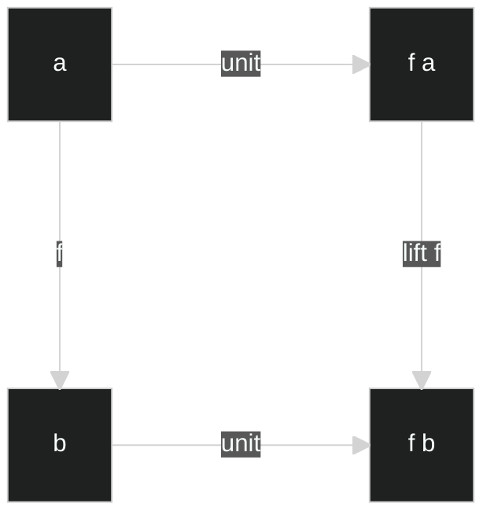
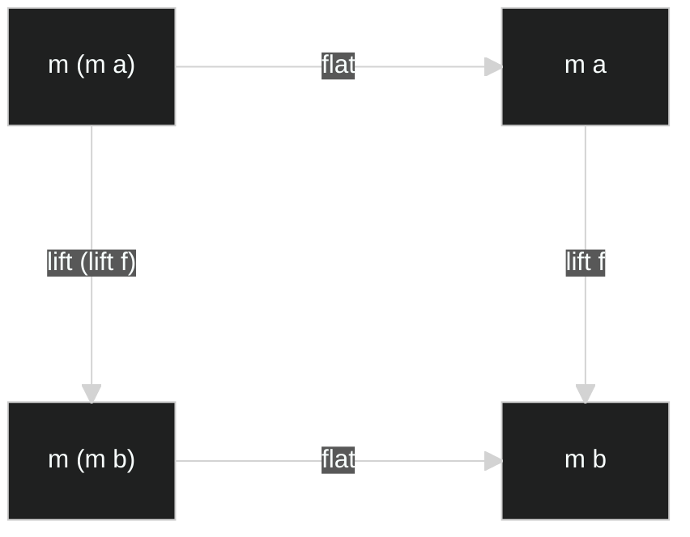
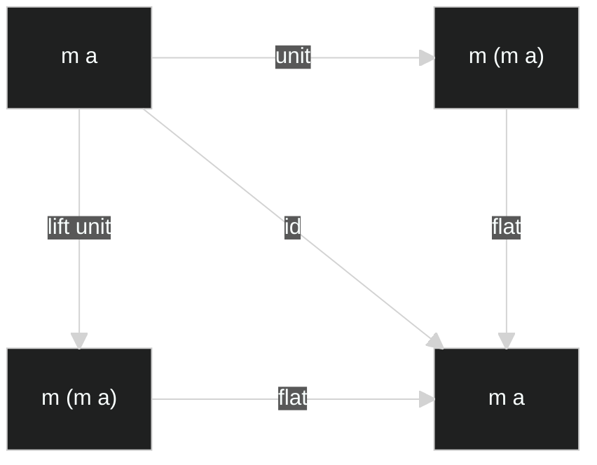
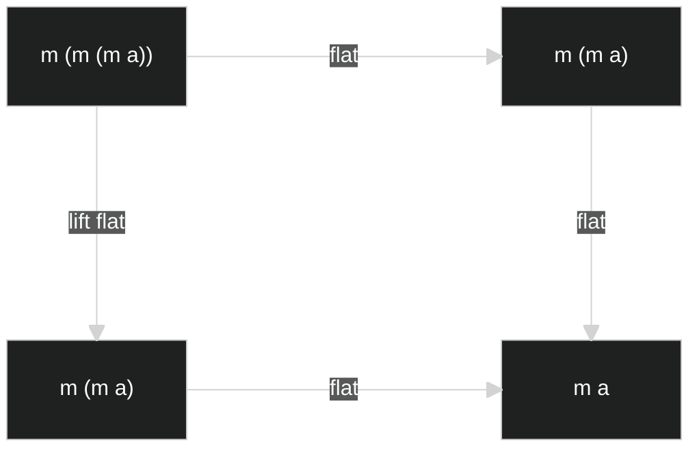
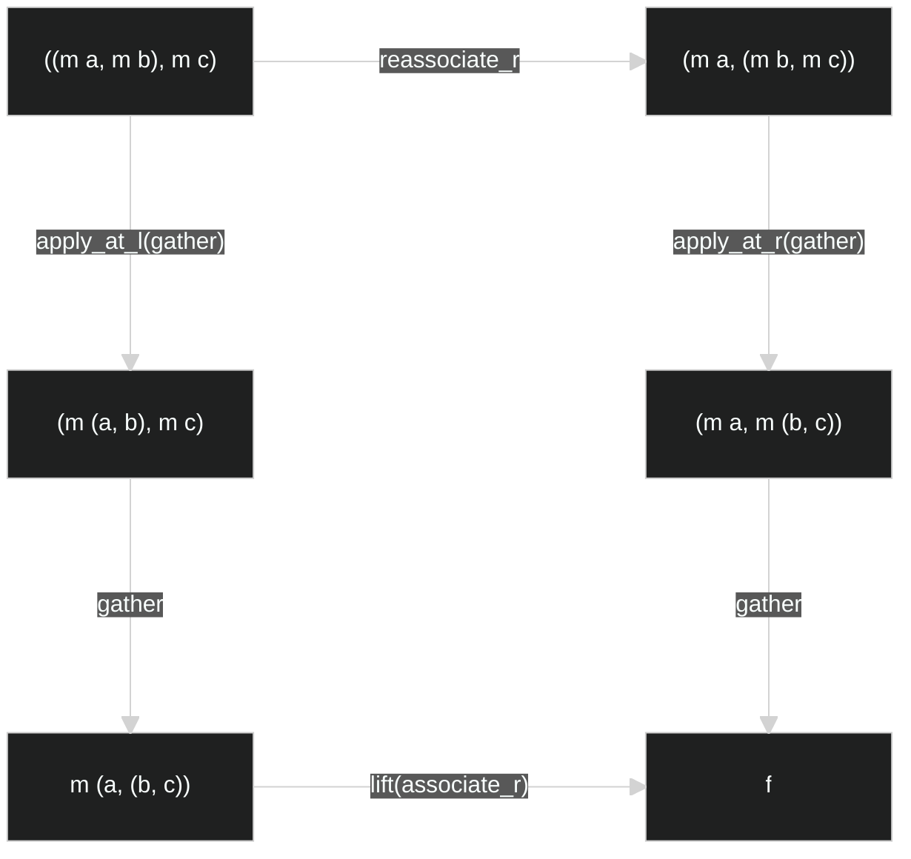
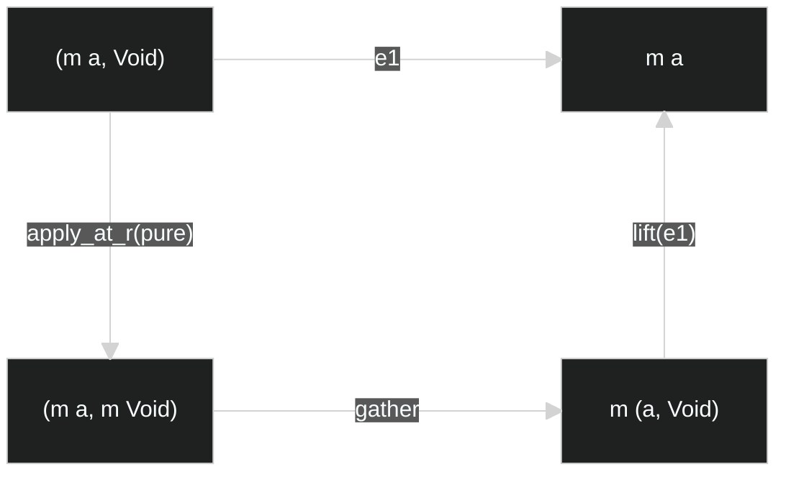

# 1. The “ideal” Monad

## 1.1. Functor

```haskell
class Functor' f where
  lift :: (t -> u) -> f t -> f u
  -- [identity conservation]    lift id = id
  -- f1 :: Functor' f => f a -> f a
  -- f1 = lift id
  -- f1 = id

  -- [composition conservation] lift (f . g) = lift f . lift g
  -- f2 :: Functor' t => (b -> c) -> (a -> b) -> t a -> t c
  -- f2 f g = lift (f . g)
  -- f2 f g = lift f . lift g
```

## 1.2. High-dimensional lift

```haskell
lift_e1 :: Functor' f => (a -> b -> c) -> f a -> b -> f c
lift_e1 t fa b = lift (\a -> t a b) fa

lift_e2 :: Functor' f => (a -> b -> c) -> a -> f b -> f c
lift_e2 t a fb = lift (\b -> t a b) fb
```

```haskell
lift_2d :: Functor' f => (a -> b -> c) -> f a -> f b -> f (f c)
lift_2d = lift_e1 . lift_e2
lift_2d = lift_e2 . lift_e1

lift_2d t fa fb =
  lift (\a ->
    lift (\b ->
      t a b
    ) fb
  ) fa
```

```
lift_3d :: Functor' f => (a -> b -> c -> d) -> f a -> f b -> f c -> f (f (f d))
lift_3d t fa fb fc =
  lift (\a ->
    lift (\b ->
      lift (\c ->
        t a b c
      ) fc
    ) fb
  ) fa
```

## 1.3. Monad

```haskell
class Functor' m => Monad' m where
  unit :: a -> m a       -- return이라는 이름을 쓰기도
  flat :: m (m a) -> m a -- join이라는 이름을 쓰기도

  -- bind :: m a -> (a -> m b) -> m b
  -- flatmap :: (m a -> a -> m b) -> m b
  -- 특정 언어들의 사정에 맞게 변경된 버전.

  -- [naturality for unit] for given f :: a -> b,
  --                       unit . f  = (lift f) . unit
  -- f3 :: Monod' m => (a -> b) -> a -> fb
  -- f3 f = unit . f
  -- f3 f = (lift f) . unit

  -- [naturality for flat] for given f :: a -> b,
  --                       flat . lift (lift f) = (lift f) . flat
  -- f4 :: Monad' m => (a -> b) -> m (m a) -> m b
  -- f4 f = flat . lift (lift f)
  -- f4 f = (lift f) . flat

  -- [identity] id = flat . unit = flat . (lift unit)
  -- f5 :: Monad' m => m a -> m a
  -- f5 = id
  -- f5 = flat . unit
  -- f5 = flat . (lift unit)

  -- [associativity] flat . flat = flat . (lift flat)
  -- f6 :: Monad' m => m (m (m a)) -> m a
  -- f6 = flat . flat
  -- f6 = flat . (lift flat)
```

### <p align="center">[naturality for unit]</p>



### <p align="center">[naturality for flat]</p>



### <p align="center">[identity]</p>



### <p align="center">[associativity]</p>



## 1.4. flatlift

모나드의 유용성을 알아보자.

```haskell
lift :: Functor' f => (a -> b) -> f a -> f b
unit :: Monad' m => a -> m a
flat :: Monad' m => m (m a) -> m a

f :: Monad' m => a -> m b
g :: Monad' m => b -> m c
```

이러한 `f`와 `g`가 있을 때, 이들을 자연스럽게 합성하려면 어떻게 해야할까?

우선 lift g에 대해 작성해보자.

```haskell
lift_g :: Monad' m => m b -> m (m c)
lift_g = lift g
```

우리는 자연스러운 합성을 위해 `m b -> m c`를 원한다.

이는 `lift_g :: m b -> m (m c)`와 `flat :: m (m c) -> m c`의 합성으로 얻어낼 수 있다.

```haskell
flatlift_g :: Monad' m => m b -> m c
flatlift_g = flat . lift_g
```

이제 일반화된 `flatlift`를 정의해보자. `flatlift`는 인자로 `g :: b -> m c`와 같은 형태를 받을 것이다.

```haskell
flatlift :: Monad' m => (b -> m c) -> m b -> m c
flatlift g = flat . (lift g)
```

이제 우리는 `f`와 `g`의 자연스러운 합성을 정의할 있다.

```haskell
compose_ex :: Monad' m => (b -> m c) -> (a -> m b) -> a -> m c
compose_ex g f = (flatlift g) . f
```

우리가 사용하던 `Functor`의 `lift`의 차원 확장에는 불편함이 있었으니,

```haskell
lift_2d :: Functor' f => (a -> b -> c) -> f a -> f b -> f (f c)
lift_2d t fa fb =
  lift (\a ->
    lift (\b -> t a b) fb
  ) fa
```

바로 마지막 반환값에 제너릭이 중첩된다는 불편함이었다.

이제 우리는 `flatlift`의 차원 확장을 통해 중첩되지 않는 제너릭을 반환하는 함수를 정의할 수 있게 되었다.

```haskell
flatlift_2 :: Monad' m => (a -> b -> m c) -> m a -> m b -> m c
flatlift_2 t ma mb =
  flatlift (\a ->
    flatlift (\b -> t a b) mb
  ) ma

flatlift_3 :: Monad' m => (a -> b -> c -> m d) -> m a -> m b -> m c -> m d
flatlift_3 t ma mb mc =
  flatlift (\a ->
    flatlift (\b ->
      flatlift (\c -> t a b c) mc
    ) mb
  ) ma
```

고로 `flatlift_{n}`는 제너릭을 반환하는 함수를 자연스럽게 확장시킬 수 있게 도와주는 고마운 도구이다.

만약 제너릭을 반환하지 않는 `(a -> b -> c)`의 형태더라도 `c`에 `unit`을 씌워 `m c`로 만들 수 있다.

## 1.A.1. 부록 - Monoidal Functor

`Functor`와 `Monad` 사이에는 `Applicative Functor`라는 중간 단계가 있다.

`Applicative Functor`는 원래 `Monoidal Functor`라고 하는 것의 다른 이름이다.

우선 `Monoidal Functor`가 있기 위해서는 다음과 같은 타입들을 지원해야 한다:

```haskell
-- empty type의 존재
data Void

-- 2-tuple type의 존재
data two_tuple a b = (a, b)
```

그리고 다음과 같은 기본 함수들을 제공해야 한다:

```haskell
empty :: () -> Void
empty a = case a of {}

unite :: (a, b) -> (a, b)
unite (a, b) = (a, b)

e1 :: (a, b) -> a
e1 (a, _) = a

e2 :: (a, b) -> b
e2 (_, b) = b
```

사실 `Monoidal Functor`는 다음 부록에서 소개할 `Applicative Functor`를 먼저 보고 오는 게 편할 수 있는데,

`Applicative Functor`에서 `currying`이라는 개념이 나오기 때문이다.

`Monoidal Functor`에서는 n-tuple의 존재와, curying의 개념을 사용하지 않아서

n개의 인자를 받아 중첩된 2-tuple을 반환하는 `unite_{n}` 함수와

(n-다인수 함수를 입력으로 받는 함수)를 입력으로 받아, (중첩된 2-tuple을 입력으로 받는 함수)를 반환하는 `unite_arg_{n}` 함수가 필요하다.

여기서 중첩된 2-tuple이란,

```haskell
-- (a, b, c, d)
-- 를, 다음과 같이 표현하는 것.
-- (((a, b), c), d))
```

또한, 서로 다른 구조를 가진 두 중첩된 2-tuple 타입 사이의 변환 함수 `reassociate_r`과 `reassociate_l` 함수까지 정의가 필요하다.

앞서 말한 함수들을 모두 작성해보자:

```haskell
unite_0 = empty
unite_1 = id
unite_{n} :: (t1, t2, ..., t{n}) -> ((... ((t1, t2), t3), ...), t{n})
unite_{n} (t1, t2, ..., t{n}) = unite(unite_{n-1}(t1, t2, ..., t{n-1}), t{n})
-- 여기서 (t1, t2, ..., t{n})은 n-tuple이 아니라, n개의 입력을 받는 다인수 함수의 입력 부분인 것이다.
```

```haskell
unite_arg_2 f p = f( e1(p) , e2(p) )
unite_arg_3 f p = f( e1(e1(p)) , e2(e1(p)) , e2(p) )
unite_arg_4 f p = f( e1(e1(e1(p))) , e2(e1(e1(p))) , e2(e1(p)) , e2(p) )
unite_arg_{n} :: ((t1, t2, ..., t{n}) -> u) -> (((... (t1, t2), t3), ...), t{n} -> u)
```

```haskell
reassociate_r :: ((a, b), c) -> (a, (b, c))
reassociate_r p = unite( e1(e1(p)) , unite( e2(e1(p)) , e2(p) ) )
reassociate_l :: (a, (b, c)) -> ((a, b), c)
reassociate_l p = unite( unite( e1(p) , e1(e2(p)) ) , e2(e2(p)) )
```

그리고 2-tuple의 왼쪽에만 함수를 적용해주는 `apply_at_l`과 오른쪽에만 적용해주는 `apply_at_r`도 추가적으로 정의하자.

이 함수는 변환함수 `(a -> c)` 또는 `(b -> c)`를 입력으로 받아서 (2-tuple을 변환해주는 함수)를 반환하는 함수이다.

```haskell
apply_at_l :: (a -> c) -> ((a, b) -> (c, b))
apply_at_l t (a, b) = (t(a), b)
apply_at_r :: (b -> c) -> ((a, b) -> (a, c))
apply_at_r t (a, b) = (a, t(b))
```

그렇다면 이제 `Monoidal Functor`에 대해 작성해보자:

```haskell
class Functor' m => MonoidalFunctor m where
  pure' :: a -> m a
  gather :: (m a, m b) -> m (a, b)

  -- [conservation of associativity]    lift(reassociate_r) . gather . apply_at_l(gather) = gather . apply_at_r(gather) . reassociate_r
  -- f7 :: MonoidalFunctor m => ((m a, m b), m c) -> m (a, (b, c))
  -- f7 = lift(reassociate_r) . gather . apply_at_l(gather)
  -- f7 = gather . apply_at_r(gather) . reassociate_r

  -- [conservation of identity element] e1 = lift(e1) . gather . apply_at_l(pure)
  -- f8 :: MonoidalFunctor m => (m a, Void) -> m a
  -- f8 = e1
  -- f8 = lift(e1) . gather . apply_at_r(pure')
```

그렇다면 `Monoidal Functor`는 왜 있는 것일까?

바로, 다인수 함수의 자연스러운 `lift`를 위해서이다.

```haskell
lift_2d :: Functor' f => ((a, b) -> c) -> ((f a, f b) -> f (f c))
```

`Functor`에서 정의한 다인수 함수에서 반환값은 차원만큼이나 제너릭이 중첩되어 있다.

우리는 중첩되지 않은 제너릭을 반환하는 `lift_{n}`을 정의하고 싶은 것이다.

```haskell
lift_0 :: Functor' f => (Void -> a) -> (Void -> f a)
```

그리고 아무 인수를 요구하지 않는 함수도 `lift_0

### <p align="center">[conservation of associativity]</p>



### <p align="center">[conservation of identity]</p>



## 1.A.2. 부록 - Applicative Functor

함수형 프로그래밍 언어들에서는 다인수 함수를 어떻게 다룰까?

우리가 `Functor`와 `Monad`에 대해 알아보며 `lift`와 `flatlift`의 차원 확장을 해보았었다.

```haskell
lift_3d :: Functor' f => (a -> b -> c -> d) -> f a -> f b -> f c -> f (f (f d)))
```

함수라고 생각하면 `입력값 -> 출력값`의 형태로만 생겨야될 것 같지만, 이 곳에서는 화살표가 너무 많다.

이 것을 우리가 쉽게 생각할 수 있는 다인수 함수 버전으로 바꾸면 다음과 같다:

```haskell
lift_3d :: Functor' f => ((a, b, c) -> d) -> (f a -> (f b -> (f c -> f (f (f d)))))
lift_3d :: Functor' f => (((a, b, c) -> d), f a, f b, f c) -> f (f (f d))
```

사실 이래도 화살표를 1개로 만들 수는 없다.

왜냐면 입력값에 함수가 들어가기 때문이다.

우리가 보통 다인수 함수를 생각해보면 `f(t, u, v) -> w` 이런식이다.

입력값 t, u, v를 받아서 w를 반환하겠다는 것인데,

f가 입력값 t 한 개만 받고, u와 v는 f가 반환하는 함수에 넣어 w를 반환시키게 만들면 어떨까?

더 나아가, f가 반환하는 함수가 u, v 두 개를 받는 게 아니라 u 한 개만 받고, v를 받아 w를 반환하는 함수를 반환하게 만들면 어떨까?

말로는 복잡하지만, 수식으로 보면 이렇다.

```haskell
f0 :: (t, u, v) -> w
f1 :: t -> ((u, v) -> w)
f2 :: t -> (u -> (v -> w))
```

그 결과, 값 w를 얻기 위해서 f0(t, u, v)를 쓰거나 f2(t)(u)(v)를 쓰는 것은 똑같다.

그렇다면 왜 이런식으로 함수를 반환하는 함수 같은 것을 쓰는 걸까?

다인수 함수의 경우, 인자가 한 개라도 없으면 호출할 수 없지만,

이러한 형태의 함수는 앞에서부터 주어지는 인자부터 넣으며 함수를 반환하는 함수를 반환하기 떄문에, 유연하다.

사실 Haskell에서,

```haskell
f2 :: t -> (u -> (v -> w))
f3 :: t -> u -> v -> w
```

다음 두 함수는 완전히 똑같다. 즉 화살표 연산자는 괄호를 붙일 때, 오른쪽 얘들부터 결합시킨다는 것이다.

이러한 방식의 연산자를 right-to-left associativity를 가졌다고 말한다.

그렇다고,

```haskell
f0 :: (t, u, v) -> w
f3 :: t -> u -> v -> w
```

다음 두 함수가 인자들에 따라 하는 방식이 똑같다고 해도, 호출 방식은 다른데,

```haskell
f0 (t, u, v)

f3(t)(u)(v)
-- 또는
(((f3 t) u) v)
-- 또는
f3 t u v
```

`f0`의 경우 호출방식은 1개이다.

반면에 `f3`의 경우 우리가 흔히 아는 것처럼 `f3(t)(u)(v)`로 호출할 수도 있지만 괄호가 많아 번거롭다.

그래서 하스켈에서는 이런 함수를 괄호 없이 호출하는 방법이 있는데 `(((f3 t) u) v)` 이런식으로 함수 다음에 인자를 공백으로만 구분해 써주면

이게 `f3(t)`처럼 호출하는 게 된다는 것이다.

더군다나 `f3 t`가 반환하는 것도 함수이기에, 바로 뒤에 `u`를 붙이고, `f3 t u`가 반환하는 것도 함수이기에,

바로 뒤에 `v`를 붙여도 되는 것이다. 형태는 `f3 t u v` 이런식이다.

이걸 보면 이러한 형태의 함수를 사용하는 것의 이점이 바로 보인다.

`v`를 사용하지 않고 `f3 t u`까지만 진행하여 `v -> w`인 함수를 얻을 수 있는 것이다.

이러한 형태의 함수를 currying된 함수라고 부른다.

일반 다인수 함수를 currying된 함수로 curry해주는 함수가 있다.

```haskell
currying_3 :: ((a, b, c) -> d) -> a -> b -> c -> d
currying_3 t =
  (\a ->
    (\b ->
      (\c -> t (a, b, c))
    )
  )

currying_{n} :: ((t1, t2, ..., t{n}) -> u) -> t1 -> t2 -> ... -> t{n} -> u
currying_{n} t =
  (\t1 ->
    (\t2 ->
      ...
        (\t{n} -> t (t1, t2, ..., t{n})
      ...
    )
  )
```

물론 currying된 함수를 원래 다인수 함수로 되돌리는 함수도 있다.

```haskell
uncurrying_3 :: (a -> b -> c -> d) -> ((a, b, c) -> d)
uncurrying_3 t = (\(a, b, c) -> t a b c)

uncurrying_{n} :: (t1 -> t2 -> ... -> t{n} -> u) -> ((t1, t2, ..., {tn}) -> u)
uncurrying_{n} t = (\(t1, t2, ..., t{n}) -> t t1 t2 ... t{n})
```

## 1.5. How to use

1. 모나드 함수 `lift`, `unit`, `flat`, `flatlift` 등을 직접 사용

고차 함수 활용 방법과 다를 바 없음

반복되는 패턴을 함수화

```haskell
foldl, reapply, repeat :: Container c => c t -> b -> (b -> a -> b) -> b
```

고차함수 특) 익명 함수를 인수로 보냄

2. 언어마다 주어지는 모나드 전용 문법 사용

```haskell
do {
  t <- opt_t
  u <- opt_u
  f(t, u)
}

-- "t <- opt_t"의 의미: 아래 있는 식을 t의 함수로 보고 flatlift한 다음 opt_t로 호출.

flatlift (\t ->
  flatlift (\u ->
    f(t, u)
  ) opt_u
) opt_t
```

```haskell
do {
  t <- opt_t
  unit(true)
}
-- 결과에 주는 영향: t가 Nothing이면 Nothing, Just a여야 통과..
-- 이럴 때 변수 생략 기능
do {
  opt_t
  unit(true)
}
-- 연산할 때마다 뭔가 부가 작용이 쌓이는 IO 모나드 같은 것에서 사용 가능
-- 유사 명령형 코딩 가능함.
```

## 1.6 various monads

```haskell
instance Functor' Maybe where
  lift f (Just t) = 
```

`List`

`Future`: 미래에 어떤 이벤트가 발생한 후에만 얻을 수 있는 값

# 2. Monad in Mathematics

프로그래밍의 모나드 - 수학의 모나드 중, 타입 카테고리의 모나드라고 하는 특별한 모나드에 불과

Functor, Limit, Monad, Adjunction, Applicative, Comonad, ...

## 2.1. Category

카테고리 - 일종의 집합과 비슷한 것
- object(대상): 원소의 정보
- morphism(사상): 원소 간 관계의 정보
    - F : A -> B, G : A -> B. 같은 대상 간에도 여러 개의 사상 존재 가능

카테고리 조건
1. 사상은 합성 가능해야.
  f : A -> B, g : B -> C가 있으면, g . f : A -> C도 있어야 함.
2. 사상은 결합법칙을 만족해야.
  f : A -> B, g : B -> C, h : C -> D일 때, (h . g) . f = h . (g . f)
3. 모든 대상은 자기자신으로 가는 항등사상이 있어야 함.
  f . id = f, id . f = f

우리는 많은 것을 합성 가능한 관계를 통해 분석한다.

그런 분석은 항상 어떤 카테고리를 만들어내기 마련.

서로 다른 집합들을 비교하고 대응시키기 가장 좋은 수단, 함수도 중요하게 다루는 집합론.

Set, Grp, Top, ... 카테고리.

수학의 여러 다른 분과에서 찾아지는 공통되는 구조를 함께 다루기 위해 만들어진 메타 수학 이론.

타입과, 함수. Type 카테고리.

Set 카테고리 : 모든 집합을 대상으로, 집합 간의 모든 함수를 사상으로 하는 카테고리

보통 이런건 대상과 사상이 무한하니까 다이어그램 그릴 때는 그때그때 관심 있는 집합과 함수만 점과 화살표로 나타냄.

bijection(전단사)의 일반화: isomorphism(동형사상)

전단사 <=> 역함수의 존재

isomorphism(동형사상)의 정의

```
사상 f : A -> B가 역사상 f^-1 : B -> A를 가지고 있고,
f^-1 . f = id_A
f . f^-1 = id_B를 만족하면 그것을 동형사상이라고 한다.
두 대상 사이에 동형사상이 한 개라도 있으면, 두 대상을 isomorphic(동형)이라고 한다.
A ~= B, B ~= C이면, A ~= C. 즉, 동형은 동치관계
```

Set 카테고리에서, 원소 수가 같은 집합들은 동형이 된다.

injection(단사)의 일반화: monomorphism(단사사상)

```
사상 f : A -> B, 사상 g_1, g_2 : Z -> A
f(g_1(x))와 f(g_2(x))가 모든 x에 대해 같다면 g_1(x)와 g_2(x)도 같을 수 밖에 없다.
if f . g_1 = f . g_2, then g_1 = g_2
```

surjection(전사)의 일반화: epimorphism(전사사상)

```
사상 f : A -> B, 사상 g_1, g_2 : B -> Z
f를 함수로 봤을 때, 집합 A의 어떤 부분집합에 대해서는 전단사 함수(단사성)이기 때문에
g_1(f(x))와 g_2(f(x))가 모든 x에 대해 같다면 g_1(x)와 g_2(x)도 같을 수 밖에 없다.
if g_1 . f = g_2 . f = g_1 = g_2
```

terminal object(카테고리에서 다른 모든 대상들에서 해당 대상으로 향하는 사상이 단 한 개만 있다면)

```
가지고 있을 수도, 없을 수도

원소가 하나뿐인 집합들의 특징 : 모든 집합에 이러한 집합으로 가는 함수가 딱 한 개만 존재
```

initial object(카테고리에서 다른 모든 대상들로 향하는 사상이 단 한개만 갖도록 하는 대상)

```
Set 카테고리에서는, 공집합.
모든 집합의 부분집합(이것도 관계, 사상으로 보기.)
임의의 모든 집합(대상)에 대해 공집합에서 해당 집합으로 가는 사상 존재
공집합도 항등사상 있어야 되니까 대응시키는 원소가 없더라도 함수로 치는 게 더 자연스럽다.
```

Curry-Howard correspondence : 논리학의 증명 연산과 프로그래밍의 타입 체계가 대응된다.

서로 유사한 두 카테고리를 연결지을 수 있는 수단이 필요: 함자

## 2.2. Functor

동질의 대상들을 수학적으로 다루다 보면, 그것들을 비교하거나 대응시킬 수 있는 `수단`도 늘 필요해지기 마련.

카테고리들을 비교하거나 대응시킬 수단도 필요하다. Functor

함자 : 한 카테고리의 대상과 사상을, 다른 사상의 대상과 사상에 각각 대응시키는 관계. (대상과 사상 간의 관계와, 항등사상과, 사상의 합성도 보존해야)

```
f : X -> Y
F(f) : F(X) -> F(Y) // F(f)는 이걸 만족해야.
```

함자끼리도 합성이 가능하다.

임의의 모든 카테고리에 대해서 항등함자도 정의 가능.

1절에서 일반적인 사상에 관해 다룬 모든 것들은 함자에도 적용됨. 동형사상, 단사사상, 전사사상.

중요한 것 - 동형사상에 해당하는 함자들 : 다이어그램이 점과 화살표에 달린 레이블만 빼고 완전히 같은 카테고리들 사이에서만 존재.

프로그래머들에게 있어 가장 중요한 함자 : 정의역과 공역이 같은 카테고리 C -> 카테고리 C.

endofunctor(자기함자). 프로그래밍의 Functor는 `Type 카테고리의 자기함자`이다.

물론, 프로그래밍에 다른 함자들도 많이 사용된다.

```haskell
-- 타입 컨트스럭터 Evaluator<T> : T -> double
lift :: (a -> b) -> Evaluator a -> Evaluator b
-- 는 함수의 항등성과 합성관계를 다 보존하도록 정의할 수 없다.

-- anti_lift :: (b -> a) -> Evaluator a -> Evaulator b
anti_lift :: (b -> a) -> (a -> double) -> (b -> double)
anti_lift f ea = ea . f
-- 는 정의 가능.
```

이건 Type에서 Type으로 가능 함자는 아니지만, 다른 어떤 카테고리에서 Type으로 가는 함자로 볼 수 있음.

Type에서 사상의 방향만 반대로 한 카테고리, Type^op, Type의 opposite 카테고리.

C의 모든 대상을 공유하면서 사상의 방향만 반대인 카테고리: C의 opposite 카테고리. C^op

여기서는 함수 T -> U가 아니라, 함수 U -> T가 사상 T -> U로 취급된다.

C^op에서 D로 가는 함자는: C에서 D로 가는 contravariant(반변)함자라고 한다.

Evaluator는 Type에서 Type으로 가는 반변자기함자.


일부 타입 컨스트럭터는 두 개 이상의 타입 인수 요구

Pair<T, U>

임의의 T에 대해 Pair<T, >, Pair< ,T>는 Type의 자기함자.

Pair 자체는 어떨까?

카테고리 C, D가 있을 때, C, D의 대상으로 이루어진 순서쌍들을 대상으로 하는 카테고리 C × D도 정의 가능.

```
f : X1 -> Y1
g : X2 -> Y2
C × D에서는 사상 (f, g) : (X1, X2) -> (Y1, Y2) // 모든 사상 순서쌍
```

이걸 product 카테고리라고 함.

Pair는 Type × Type에서 Type으로 가는 함자임.

일반적으로 타입 인수 두 개를 요구하는 타입 컨스트럭터는 각각의 타입의 타입 인수에 대해 모두 Type에서 Type으로 가는 자기함자일 경우, 항상 Type × Type에서 Type으로 가는 함자가 된다.

```
Pair< ,T> : Type -> Type
Pair<T, > : Type -> Type
Pair<T, U>: Type × Type -> Type
```

```haskell
-- Function< ,T> : Type^op -> Type
anti_lift :: (b -> a) -> (a -> t) -> (b -> t)
-- Function<T, > : Type -> Type
lift :: (a -> b) -> (t -> a) -> (t -> b)
-- Function<T, U>: Type^op × Type -> Type
```

## 2.3. natural transformation

같은 두 카테고리를 연결하는 함자들 중에서는 유사한 의미를 갖거나 서로 관계가 있는 것들이 있음.

Type 카테고리에서 ArrayList 자기함자, LinkedList 자기함자.

ArrayList : T -> ArrayList<T>
LinkedList : T -> LinkedList<T>

프로그래밍 언어에서 서로 다른 구현 원리에 기반한 수 많은 리스트 타입 제너릭이 존재

이 리스트 함자들은 모두 동등. 다 동형. 각 리스트 타입 사이의 상호 변환 함수를 쉽게 정의할 수 있음.

게다가 같은 lift 함수를 써서, to_linked, to_array와의 합성 순서에 따른 차이가 없음

때로는 이러한 유사한 관계가 일방향 관계으로 존재하기도. Optional과 List. 같은 list 함수 써서 크게 상관 없음. to_optional은 없지만.

=> 함자들 간에도 이들 간의 관계를 말해줄 수 있는 일종의 사상이 필요할 수 있다.

natural transformation(자연변환)이 바로 그런 것.

```
함자 F : 카테고리 C -> 카테고리 D
함자 G : 카테고리 C -> 카테고리 D

카테고리 C의 모든 대상 X에 F(X)에서 G(X)로 가는 대응되는 D의 사상 \eta X가 존재한다면,
그리고 그 대응이 C의 임의의 사상 f에 대해 D의 다이어그램을 commute(가환)하게 했다면
F(f)   : F(X) -> F(Y)
G(f)   : G(X) -> G(Y)
\eta X : F(X) -> G(X)
\eta Y : F(Y) -> G(Y)
그 대응 \eta를 F에서 G로의 자연 변환이라고 한다.

다이어그램의 가환성: 다이어그램의 한 점과 다른 한 점을 잇는 모든 경로가 같은 합성 사상을 준다는 것.
어떤 경로로 두 사상을 합성하든 결과가 똑같다.
```

자연변환도 합성이 가능하다.

```
함자 F, G, H : C -> D가 있을 때
\eta X     : F(X) -> G(X)
\epsilon X : G(X) -> H(X)가 있으면
자연변환 \epsilon . \eta도 정의할 수 있음.
(\epsilon . \eta)(x) = \epsion(x) . \eta(x)
자연변환 \epsilon . \eta의 자연변환 조건 만족.
가환한 다이어그램을 연결시킨 것도 가환.

이걸, 자연변환의 vertical composition(세로 합성)라고 함.
F(X) -> G(X) -> H(X)에 세로로 행 추가
F(Y) -> G(Y) -> H(Y)
```

```
자연변환의 horizontal composition(가로 합성)
F1, F2 : C -> D
G1, G2 : D -> E
// C의 대상은 X, D의 대상은 P
\eta x     : F1(X) -> F2(X)
\epsilon p : G1(P) -> G2(P)

카테고리 E에다가 G1(F1(X)), G2(F2(X)).
G1 . F1 : C -> E
G2 . F2 : C -> E
카테고리 E에다가 (\epsilon * \eta) x 정의 가능.
```

```
항등 자연변환. identity natural transformation.
임의의 함자 F에는 항등 자연 변환도 존재.
```

```
같은 두 카테고리 사이의 자연변환은 세로합성을 통해 합성, 항등 자연변환도 있으므로,
이 자체도 사상의 모든 조건 만족.

대상과 사상으로 이뤄진 체계 카테고리.
그 체계 사이의 사상이 함자.
다시 그것들 사이에서 사상 역할 하는 게 자연변환.
```

프로그래밍에서 Functor는 확실히 lift라는 함수의 함수 같은 요소 포함하긴 함.

```haskell
class Functor f where
  lift :: (a -> b) -> f a -> f b
```

자연변환. 한 Functor타입의 값을 다른 Functor타입으로 바꾸는 그냥 함수들.
```haskell
-- to_g :: (Functor f, g) => f t -> g t
to_list :: Maybe a -> List a
to_list ma = case of
```

대상들 간에 합성 가능한 관계는 무엇이든 사상이 된다.

오히려 대상이 복잡할 수록 사상은 단순한게 나올 수 있다.

함자 카테고리: 카테고리 C에서 D로 가는 함자들을 대상으로, 그들 사이의 자연변환을 사상으로 하는 카테고리.

[C, D], D^C

자기함자 카테고리. [C, C], C^C

```
대상들 사이에 합성이라는 이항연산 정의 가능. 이 연산에 대해 닫혀있음.
F, G가 [C, C]의 대상이면, F . G도.
합성 결합법칙 만족, 항등원소도 있음.

사상 사이에도 이항연산 존재.
\eta     : F1 -> F2
\epsilon : G1 -> G2
\epsilon * \eta : G1 . F1 -> G2 . F2
```

```
(., *) : [C, C] × [C, C] -> [C, C]
이러한 함자 정의 가능
```

모나드는 자기함자 카테고리의 모노이드일 뿐이다.

## 2.4. monad

```
카테고리 C의 모나드 (T, \eta, \mu)는 C의 어떤 자기함자 T로써
\eta : C의 항등함자 id_C ->  T로 가는 자연변환
\mu  : T . T -> T로 가는 자연변환
```


# 3. Monad in practice
